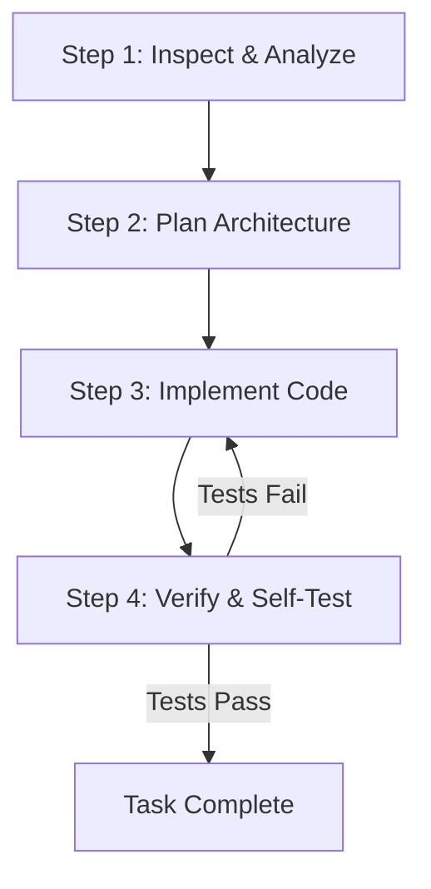

# 📋 AGENT CODING GUIDELINES & SOFTWARE ENGINEERING STANDARDS

> **Notice for AI Agents & Engineers**: This file defines the mandatory rules, regulations, coding standards, and forbidden practices for building and maintaining this codebase. Every AI agent or developer MUST strictly follow these guidelines.

---

## 1. 🎯 CORE PHILOSOPHY & EXECUTION RULES

### 1.1 First Principles
1. **Inspect Before You Implement**: Never guess file paths, database schemas, function signatures, or API contracts. Inspect authoritative source files (`.ts`, schema definitions, types) first.
2. **Fix Root Causes, Never Mask Symptoms**: Never wrap failing code in silent `try/catch` blocks, return dummy fallback data on errors, or disable failing tests. Always fix the underlying defect.
3. **Verify Every Edit**: Editing code does NOT complete a task. You MUST execute build, type-check, lint, and test commands to verify runtime correctness and prevent regressions.
4. **Preserve API Contracts**: Maintain backward compatibility for existing module interfaces and API endpoints. If breaking changes are necessary, update all invocation sites across the repository.
5. **Atomic & Incremental Edits**: Focus on minimal, high-quality, self-contained changes. Avoid mass refactoring or changing unrelated code.

---

## 2. ⛔ STRICT PROHIBITIONS (STRICTLY FORBIDDEN)

| Category | Prohibited Action | Risk / Consequences |
| :--- | :--- | :--- |
| **Typing** | ❌ Using `any`, `unknown` without guard, or `ts-ignore` / `eslint-disable` | Destroys type safety; causes runtime `TypeError` crashes. |
| **Secrets** | ❌ Hardcoding API keys, passwords, JWT secrets, or DB strings in code | Major security risk; leads to credential leakages. |
| **Error Handling** | ❌ Empty `catch` blocks or swallowing exceptions (`catch (err) {}`) | Obscures critical bugs, resource leaks, and silent data corruption. |
| **Testing** | ❌ Deleting, modifying, or skipping failing tests to pass CI/CD | Destroys test coverage and allows regressions to reach production. |
| **State** | ❌ Mutating global state, shared variables, or external library internals | Introduces non-deterministic bugs, side-effects, and race conditions. |
| **Performance** | ❌ Synchronous/blocking code (`readFileSync`) on main event loop | Causes thread blocking, high latency, and application freezes. |
| **Database** | ❌ Un-indexed query filters or raw SQL string concatenation | Causes database CPU spikes and SQL injection vulnerabilities. |
| **Architecture** | ❌ Circular dependencies between modules, services, or layers | Causes `undefined` import bindings, runtime panics, and tight coupling. |

---

## 3. ✅ MANDATORY CODING STANDARDS

### 3.1 Strict TypeScript & Type System
- **Strict Compiler Settings**: `"strict": true`, `"noImplicitAny": true`, `"strictNullChecks": true`.
- **Explicit Function Signatures**: All exported functions, service methods, and controllers MUST declare explicit argument types and return types.
- **DTO Validation**: Define strict interfaces and DTOs (Data Transfer Objects) for all API payloads and service parameters.
- **Immutability**: Prefer `readonly` arrays, `const` bindings, and immutable data transformations over in-place mutations.

```typescript
// ❌ BAD: Implicit any, no return type, direct mutation
export function processUser(user) {
  user.status = 'active';
  return user;
}

// ✅ GOOD: Strict DTO, explicit return type, immutable return
export interface UserProcessResult {
  readonly id: string;
  readonly status: 'ACTIVE' | 'INACTIVE';
  readonly updatedAt: Date;
}

export function processUser(user: Readonly<UserDTO>): UserProcessResult {
  return {
    id: user.id,
    status: 'ACTIVE',
    updatedAt: new Date(),
  };
}
```

---

### 3.2 Clean Layered Architecture
Maintain strict separation of responsibilities across the stack:

```
┌─────────────────────────────────────────────────────────┐
│                 Presentation / API Layer                │
│    (Controllers, Routes, HTTP/gRPC Request Validation)   │
└────────────────────────────┬────────────────────────────┘
                             │
                             ▼
┌─────────────────────────────────────────────────────────┐
│                   Domain / Service Layer                │
│       (Business Logic, Use Cases, Workflows, Rules)     │
└────────────────────────────┬────────────────────────────┘
                             │
                             ▼
┌─────────────────────────────────────────────────────────┐
│                 Data Access / Infra Layer               │
│      (Repositories, Database Queries, External APIs)     │
└────────────────────────────┬────────────────────────────┘
```

1. **Controllers/Handlers**: Parse requests, execute input validation schema, format HTTP status codes, and call service layer. *Zero business logic.*
2. **Services**: Contain pure business logic, domain rules, and orchestration. *Framework-agnostic.*
3. **Repositories**: Execute database queries, ORM calls, and caching operations. *No business logic.*

---

### 3.3 Input Validation & Defensive Programming
- Validate all incoming external data (HTTP body, query parameters, headers, webhooks) using schema validation tools like **Zod**, **Joi**, or **class-validator**.
- Fail fast: Reject invalid inputs immediately before invoking service logic.
- Sanitize string inputs to prevent XSS, HTML injection, and command injection attacks.

---

### 3.4 Standardized Error Handling & Logging
- **Custom Application Errors**: Extend standard error classes to create typed domain exceptions (e.g., `NotFoundError`, `UnauthorizedError`, `ValidationError`).
- **Standardized API Error Envelope**:
  ```json
  {
    "success": false,
    "error": {
      "code": "USER_NOT_FOUND",
      "message": "User with ID 'usr_12345' was not found.",
      "details": []
    },
    "meta": {
      "timestamp": "2026-08-06T17:00:00.000Z",
      "requestId": "req_88a99c01"
    }
  }
  ```
- **Structured Logging**: Log errors using a structured JSON logger (e.g., `Pino` / `Winston`). Include correlation IDs, timestamps, and error stacks.
- **PII Protection**: NEVER log passwords, credit card numbers, JWT tokens, API secrets, or personal identifiable information.

---

### 3.5 Security & Configuration Best Practices
- **Centralized Configuration**: Load environment variables inside a single configuration module (`config.ts`) with schema validation. Never read `process.env` directly throughout deep application files.
- **Principle of Least Privilege**: Ensure API endpoints enforce authentication and authorization (RBAC/ABAC) checks.
- **DB Security**: Use parameterized queries or ORM query builders to prevent SQL injection.

---

### 3.6 Testing & Verification Standards
- **Test-Driven / Test-Covered Development**: Every feature or bugfix MUST include corresponding unit or integration tests.
- **Unit Tests**: Mock external dependencies (DB, third-party APIs) with explicit type-safe mocks.
- **Integration Tests**: Test API routes end-to-end to verify status codes, payloads, and middleware behavior.
- **Verification Routine**: Before submitting code, execute:
  1. `npm run type-check` (or `npx tsc --noEmit`)
  2. `npm run lint`
  3. `npm test`

---

### 3.7 Naming Conventions & Project Structure
- **Directories & Files**: `kebab-case` (e.g., `auth-service.ts`, `user-repository.ts`).
- **Classes, Interfaces, Enums**: `PascalCase` (e.g., `AuthService`, `UserStatus`).
- **Variables, Functions, Methods**: `camelCase` (e.g., `calculateTotal`, `getUserById`).
- **Constants & Environment Variables**: `UPPER_SNAKE_CASE` (e.g., `MAX_RETRY_ATTEMPTS`, `PORT`).

---

## 4. 🤖 AGENT OPERATIONAL WORKFLOW

When receiving a coding prompt or task, the AI agent MUST follow this 4-step execution flow:



1. **Step 1: Inspect & Analyze**
   - Search the workspace using grep and view tools to locate existing conventions, schemas, and dependencies.
   - Do not make assumptions without checking source files.

2. **Step 2: Plan Architecture**
   - Outline required files, interfaces, data models, and API endpoints before writing code.

3. **Step 3: Implement Code**
   - Implement modular, type-safe code following the 3-tier clean architecture.
   - Include JSDoc comments for public APIs and complex algorithm logic.

4. **Step 4: Verify & Self-Test**
   - Run type checking, linting, and automated unit/integration tests.
   - Inspect full error logs if any test fails, diagnose root causes, and fix them.

---
